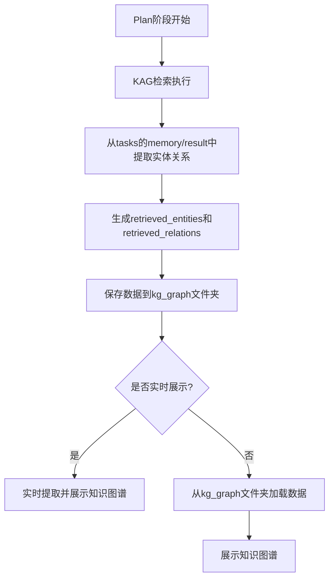

## Product Overview

修复知识图谱数据流问题，确保智能体任务和历史结果都能正确显示知识图谱

## Core Features

- 修复plan.py中第43-44行未定义的retrieved_entities和retrieved_relations变量引用问题
- 在Plan阶段正确从kag_results的tasks中提取实体和关系数据
- 确保提取的实体关系数据正确保存到kg_graph文件夹
- 验证历史结果加载时能正确读取kg_graph数据并展示知识图谱
- 确保regions、llm_thinking、kg_graph、geojson四个文件夹文件命名一致

## Tech Stack

- 基于现有项目技术栈进行修复
- Python（用于后端数据处理）

## Tech Architecture

### 系统架构

- 修复现有数据流，不引入新架构模式
- 保持现有的4文件夹数据存储结构（regions、llm_thinking、kg_graph、geojson）

### 数据流修复



## Implementation Details

### 核心目录结构

修复涉及的主要文件：

```
project-root/
├── plan.py                          # 修复：定义retrieved_entities和retrieved_relations
├── src/
│   ├── services/
│   │   └── knowledgeGraphService.py  # 修复：提取实体关系数据的逻辑
│   └── utils/
│       └── dataExtractor.py         # 修复：从kag_results提取实体和关系
```

### 关键代码结构

**实体关系数据提取接口**：从kag_results的tasks中提取实体和关系数据

```python
def extract_entities_relations(kag_results):
    """
    从kag_results的tasks中提取实体和关系数据
    :param kag_results: 包含tasks的KAG结果对象
    :return: (entities, relations) 元组
    """
    entities = []
    relations = []
    
    for task in kag_results.get('tasks', []):
        # 从task的memory中提取
        if 'memory' in task:
            extracted = _extract_from_memory(task['memory'])
            entities.extend(extracted['entities'])
            relations.extend(extracted['relations'])
        
        # 从task的result中提取
        if 'result' in task:
            extracted = _extract_from_result(task['result'])
            entities.extend(extracted['entities'])
            relations.extend(extracted['relations'])
    
    return entities, relations
```

**Plan阶段数据保存逻辑**：确保数据正确保存到kg_graph文件夹

```python
def save_kg_data(base_name, entities, relations):
    """
    保存实体和关系到kg_graph文件夹
    :param base_name: 文件基础名称（与其他文件夹一致）
    :param entities: 实体列表
    :param relations: 关系列表
    """
    import json
    import os
    
    kg_dir = 'kg_graph'
    os.makedirs(kg_dir, exist_ok=True)
    
    file_path = os.path.join(kg_dir, f'{base_name}.json')
    data = {
        'retrieved_entities': entities,
        'retrieved_relations': relations
    }
    
    with open(file_path, 'w', encoding='utf-8') as f:
        json.dump(data, f, ensure_ascii=False, indent=2)
```

### 技术实施方案

1. **问题诊断**：定位plan.py第43-44行的bug根源
2. **数据提取逻辑**：实现从tasks的memory和result中提取实体关系的函数
3. **数据保存**：修复kg_graph文件夹数据为空的问题
4. **命名一致性**：确保四个文件夹使用相同的base_name
5. **验证测试**：测试智能体任务和历史结果的知识图谱展示

### 集成点

- plan.py：Plan阶段入口，需要调用数据提取和保存逻辑
- kag_results：数据源，从tasks的memory和result中提取数据
- kg_graph文件夹：数据存储位置，历史结果从此处加载数据

## 技术考虑

### 日志记录

- 记录实体关系提取过程
- 记录数据保存操作结果
- 记录历史结果加载过程

### 错误处理

- 处理kag_results为空的情况
- 处理tasks中没有memory或result的情况
- 处理kg_graph文件夹读取失败的情况

## Agent Extensions

### SubAgent

- **code-explorer**
- Purpose: 搜索和分析plan.py及相关文件，定位未定义变量问题和数据流逻辑
- Expected outcome: 找到retrieved_entities和retrieved_relations应该在何处定义，以及kag_results的数据结构详情